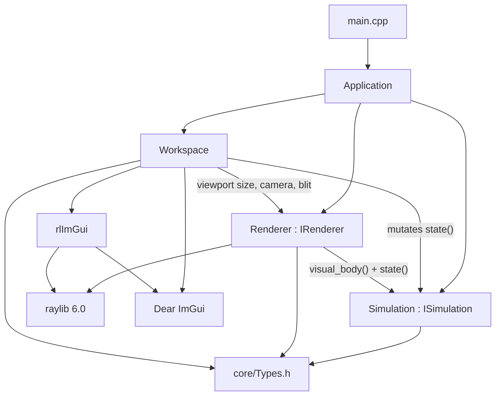
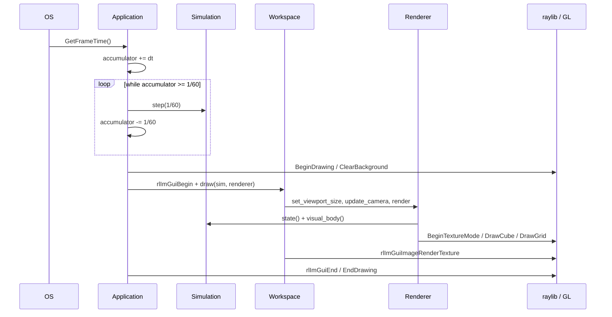

# Architecture (what the software is today)

Companion diagrams: [01-system-architecture.drawio](diagrams/01-system-architecture.drawio) (tabs: Overview, Source layout, Contracts) and [02-runtime-loop.drawio](diagrams/02-runtime-loop.drawio) (tabs: Lifecycle, Frame + timestep, Workspace UI, Data model).

This page is the written spec of **v0.1.0 as implemented**. Target platforms and hardware are [portability.md](portability.md) and [hardware.md](hardware.md).

## Shape

Open PhysX is a desktop 3D workstation shell. Three subsystems sit under one owner:



`Application` holds `Simulation`, `Renderer`, and `Workspace` **by value**. There is no service locator and no heap-owned engine singleton. Lifetime of GPU objects is tied to `InitWindow` / `CloseWindow`.

## File map

| Path | Role | May include |
| --- | --- | --- |
| `src/main.cpp` | Process entry. Constructs `Application` and returns `run()`. | `Application.h` only |
| `src/Application.h/.cpp` | Window, ImGui bootstrap, fixed-step loop, ownership | raylib, rlImGui, the three subsystems |
| `src/core/Types.h` | POD math and `SimulationState` | nothing else |
| `src/logic/ISimulation.h` | Logic contract | `core/Types.h` only |
| `src/logic/Simulation.h/.cpp` | Timeline + demo motion | `ISimulation` |
| `src/renderer/IRenderer.h` | Render contract | **currently `raylib.h` — leak** |
| `src/renderer/Renderer.h/.cpp` | FBO, orbit camera, `DrawCube` | `ISimulation`, raylib |
| `src/ui/Workspace.h/.cpp` | Dockspace, menus, property panels | `ISimulation`, `IRenderer`, ImGui, raylib for input/FPS |

Dependency direction that must hold as the project grows:

```
logic  →  core
renderer  →  core + ISimulation + graphics API
ui  →  ISimulation + IRenderer + ImGui
Application  →  all of the above + window bootstrap
```

`logic/` must never see `Camera3D`, `Texture`, `ImGui`, or an HWND. That is already written as a comment on `ISimulation` and is the reason a headless or SIMD solver can be dropped in later.

## Contracts

### `ISimulation`

```text
reset()
step(float dt)
seek(float time)
state() / state() const  → SimulationState
visual_body() const      → RigidBody   // pose the renderer should draw
```

Implemented by `Simulation`. `step` is a no-op unless `state().playing`. When playing it calls `seek(time + dt * playback_speed)`. `seek` wraps with `fmod` when looping, otherwise clamps to `[0, duration]`. End of a non-looping clip clears `playing`.

`visual_body()` copies `state().cube` and, if `demo_motion`, adds `sin(time * 3) * 0.25` to Y. The offset is **not** written back into `cube.position`, so the Properties panel keeps showing the authored pose. That split is the seed of “authoritative sim state vs interpolated render state” in [hardware.md](hardware.md).

### `IRenderer`

```text
init() / shutdown()
set_viewport_size(w, h)          // recreates FBO when size changes
render(const ISimulation&)
viewport_target() const          // RenderTexture2D
update_camera(viewport_hovered)
reset_camera()
camera()                         // Camera3D
```

Implemented by `Renderer` (non-copyable). `init` loads a 16×16 placeholder FBO; the viewport panel resizes it to the ImGui content region every frame. Camera is yaw / pitch / distance around a target, not raylib’s built-in free camera.

**Contract leak:** `IRenderer.h` includes `raylib.h` and returns `RenderTexture2D` / `Camera3D`. A Vulkan, WebGPU, or null renderer cannot implement this header. Closing that leak is a prerequisite for [portability.md](portability.md). Move camera into `core/Types.h` and make the viewport an opaque handle (`id + width + height`).

### `Workspace`

No interface yet. `draw(ISimulation&, IRenderer&)` is the whole surface. It does **not** call `step` — `Application` does. It may call `reset`, `seek`, and mutate `state()`.

Quit is not the raylib ESC key (`SetExitKey(KEY_NULL)`). It is `Ctrl+Q`, the File menu, or the Quit item on the menu bar.

## Frame

Constants live in an anonymous namespace in `Application.cpp`:

| Symbol | Value |
| --- | --- |
| `kWindowWidth` / `kWindowHeight` | 1600 × 900, resizable |
| `kTargetFps` | 60 (user can change in Settings) |
| `kFixedDt` | `1/60` s, **not** user-visible |
| Window flags | `FLAG_WINDOW_RESIZABLE \| FLAG_VSYNC_HINT \| FLAG_MSAA_4X_HINT` |



Display FPS and simulation rate are independent:

- 30 FPS display → typically two sim steps per frame
- 60 FPS → one step
- 120 FPS → two frames share one step; leftover lives in `accumulator_`
- Uncapped + a hitch → **unbounded** steps (no spiral-of-death cap yet)

Settings can toggle VSync and set target FPS to 30 / 60 / 120 / uncapped. That only changes the display clock. The solver tick stays `1/60`.

Init order is mandatory: `InitWindow` (GL context) → `rlImGuiSetup` → `renderer_.init()` (FBO) → `workspace_.init()` (theme). Shutdown is the reverse for GPU: `renderer_.shutdown()` → `rlImGuiShutdown()` → `CloseWindow()`. Do not create `RenderTexture2D` in `Renderer`’s default constructor.

## Data

All shared types are in `src/core/Types.h`.

| Type | Fields | Defaults |
| --- | --- | --- |
| `Vec3` | `x y z` | `0,0,0` |
| `Rgb` | `r g b` plus `data()` for ImGui | `0.12, 0.12, 0.14` |
| `RigidBody` | `position`, `size`, `color` | pos `(0,1,0)`, size `(2,2,2)`, blue |
| `SimulationState` | time, duration, speed, playing, loop, grid, demo motion, clear color, cube | duration 10 s, loop on, demo motion on |

The renderer converts at the edge: `Vec3` → `Vector3`, `Rgb` → `Color` (clamped 0–1 to 0–255), plus a lighter `wire_color` for `DrawCubeWires`.

One `RigidBody` as an AoS struct is correct for the scaffold. A solver that should fill a workstation needs SoA chunks; that change stays behind `ISimulation` (see [hardware.md](hardware.md)).

## UI

Default dock (from `Workspace::apply_default_layout`):

1. Split **right 28%** → Properties
2. Remaining split **down 28%** → Animation Player
3. Properties split **down 40%** → Tools
4. Remaining center → Viewport

`Window → Reset Layout` rebuilds that split. Tabs can be torn off; that is stock ImGui docking.

| Panel | What it actually does |
| --- | --- |
| Viewport | Resize FBO, orbit/pan/zoom **only while hovered**, `Renderer::render`, blit, FPS overlay. Help text: RMB orbit, Shift+RMB pan, wheel zoom. |
| Properties | Cube pose/size/color, world clear/grid/demo, camera FOV (eye/target widgets are read-only), session versions |
| Animation Player | Seek 0 / play-pause / stop / seek end / loop / timeline / duration / speed |
| Tools | Tool enum Select/Move/Rotate/Scale (**not wired to gizmos**), grid/demo checkboxes, reset buttons |

Menu stubs (visible, `enabled = false`): File Open/Save, Edit Undo/Redo. They mark future serialization and a command stack; they are not half-implemented.

ImGui docking and keyboard nav are on. Theme is a dark grey chrome with accent `#E89E3E` (the same orange used for “app shell” in the diagrams).

## Third-party

| Library | How it enters the build | Job |
| --- | --- | --- |
| raylib 6.0 | `find_package` or FetchContent tarball | Window, GL, input, 3D primitives, FBO |
| Dear ImGui | vendored `external/imgui` static lib (includes `imgui_demo.cpp`) | Docking UI |
| rlImGui | FetchContent git tag `Raylib_6_0` | ImGui ↔ raylib |

`BUILD_SHARED_LIBS` is forced off. `compile_commands.json` is on.

## What to change when you add a feature

| Feature | Where it goes | Diagram to update |
| --- | --- | --- |
| Real rigid solver | `logic/` behind `ISimulation` (new files, not a 2k-line `Simulation.cpp`) | 01 Contracts, 05 Physics pipeline |
| Gizmos | `ui/` talking to `IRenderer` debug draw + `state()` | 02 Workspace UI |
| Save / load | new `src/io/` ; Application/Workspace call it | 01 Source layout |
| Second viewport | `IRenderer` already is one FBO; instantiate more renderers or a renderer that owns N targets | 01 Contracts |
| Headless step | do not call `InitWindow`; need a null `IRenderer` and no ImGui | 04 Backend stack |

If a change makes `logic/` include `raylib.h`, it is the wrong change.
