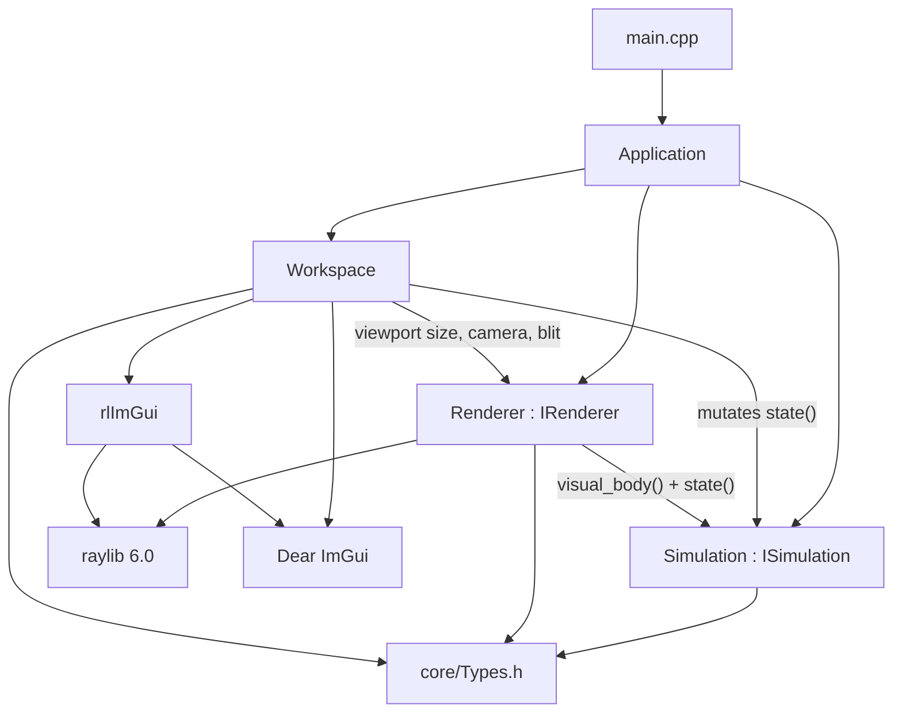
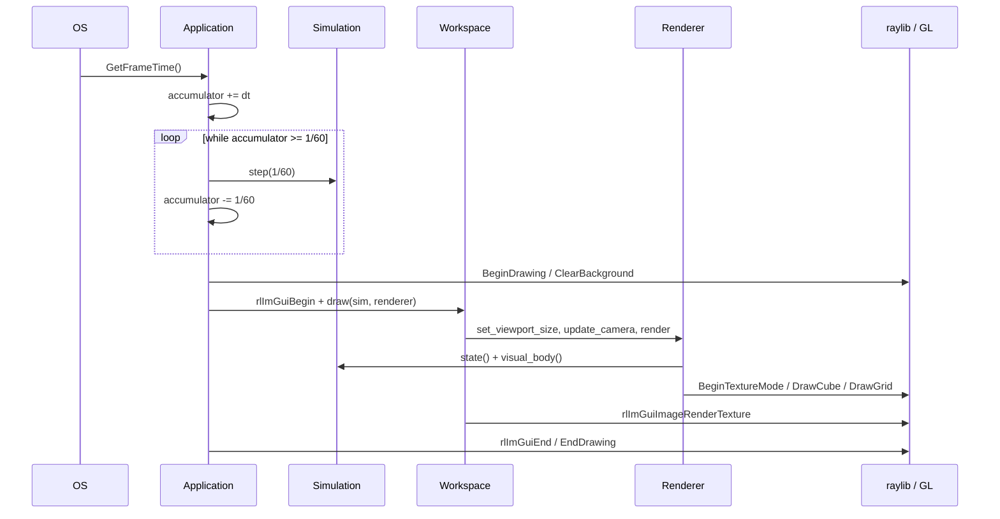

# Architecture (what the software is today)

Companion diagrams: [01-system-architecture.drawio](diagrams/01-system-architecture.drawio) (tabs: Overview, Source layout, Contracts) and [02-runtime-loop.drawio](diagrams/02-runtime-loop.drawio) (tabs: Lifecycle, Frame + timestep, Workspace UI, Data model).

This page is the written spec of **v0.1.0 as implemented**. Target platforms and hardware are [portability.md](portability.md) and [hardware.md](hardware.md).

## Shape

Open PhysX is a desktop 3D workstation shell. Three subsystems sit under one owner:



`Application` holds `Simulation`, `Renderer`, and `Workspace` **by value**. There is no service locator and no heap-owned engine singleton. Lifetime of GPU objects is tied to `InitWindow` / `CloseWindow`.

## File map

| Path | Role | May include |
| --- | --- | --- |
| `src/main.cpp` | Process entry. Constructs `Application` and returns `run()`. | `Application.h` only |
| `src/Application.h/.cpp` | Window, ImGui bootstrap, fixed-step loop, ownership | raylib, rlImGui, the three subsystems |
| `src/core/Types.h` | POD math, `Quat`, `RigidBody`, `SimulationState` | nothing else |
| `src/core/Math.h` / `View.h` | Quat, turntable view, project, zoom-to-cursor | `Types.h` only |
| `src/ecs/` | `Scene` (one EnTT registry), `Entity`, UUID, component registry, POD components | EnTT, `core/Types.h`, nlohmann/json in serializers only |
| `src/editor/command.hpp/.cpp` | `CommandStack` with a revision counter; every user edit is a command | `ISimulation`, `Scene` snapshots |
| `src/persistence/` | scene serializer, atomic write, checksum, project file, migrations, autosave, recovery, project manager, recent files, sidecar | `Scene`, JSON, std::filesystem |
| `src/logic/ISimulation.h` | Logic contract | `core/Types.h` only |
| `src/logic/Simulation.h/.cpp` | Editor scene ↔ runtime scene for Play/Stop, demo motion | `ISimulation`, `Scene` |
| `src/renderer/IRenderer.h` | Render contract | **currently `raylib.h` — leak** |
| `src/renderer/Renderer.h/.cpp` | FBO, orbit camera, `DrawCube` | `ISimulation`, raylib |
| `src/ui/Workspace.h/.cpp` | Dockspace, menus, property panels, load report panel | `ISimulation`, `IRenderer`, ImGui, raylib for FPS |
| `src/ui/Editor.h/.cpp` | Keymap, modal operators, undo stack | `ISimulation`, `IRenderer`, raylib keys |
| `src/ui/file_menu.cpp` | File menu, native dialogs, save prompts, recovery modal | NFD, `ProjectManager`, `Autosave`, ImGui |
| `src/ui/load_report_panel.cpp` | Load Report window (severity-colored warnings) | `LoadReport`, ImGui only |

Dependency direction that must hold as the project grows:

```
logic  →  core
renderer  →  core + ISimulation + graphics API
ui  →  ISimulation + IRenderer + ImGui
Application  →  all of the above + window bootstrap
```

`logic/` must never see `Camera3D`, `Texture`, `ImGui`, or an HWND. That is already written as a comment on `ISimulation` and is the reason a headless or SIMD solver can be dropped in later.

## Contracts

### `ISimulation`

```text
reset()
step(float dt)
seek(float time)
state() / state() const  → SimulationState
visual_body() const      → RigidBody   // pose the renderer should draw
```

Implemented by `Simulation`. `step` is a no-op unless `state().playing`. When playing it calls `seek(time + dt * playback_speed)`. `seek` wraps with `fmod` when looping, otherwise clamps to `[0, duration]`. End of a non-looping clip clears `playing`.

`visual_body()` copies `state().cube` and, if `demo_motion`, adds `sin(time * 3) * 0.25` to Y. The offset is **not** written back into `cube.position`, so the Properties panel keeps showing the authored pose. That split is the seed of “authoritative sim state vs interpolated render state” in [hardware.md](hardware.md).

### `IRenderer`

```text
init() / shutdown()
set_viewport_size(w, h)          // recreates FBO when size changes
render(const ISimulation&)
draw_viewport_image()            // blit. The FBO stays inside Renderer
view()                           // View3D in core/View.h
reset_view()
tick_view(dt)                    // smooth axis snaps and frame
orbit / pan / zoom_at / set_axis / toggle_projection / orbit_step / frame_bounds
```

Implemented by `Renderer` (non-copyable). `init` loads a 16×16 placeholder FBO; the viewport panel resizes it to the ImGui content region every frame. `IRenderer.h` does not include `raylib.h`. The camera is a `View3D`: quaternion, orbit pivot (`ofs` is the negative of the pivot), distance, perspective or orthographic. The raylib `Camera3D` is built only inside `Renderer.cpp`. Navigation is turntable orbit (yaw around world up, pitch around camera right, elevation clamped), pan, and zoom-to-cursor. Numpad axis views and frame-all slerp over about 0.18 s.

### `Workspace`

No interface yet. `draw(ISimulation&, IRenderer&)` is the whole surface. It does **not** call `step` — `Application` does. It may call `reset`, `seek`, and mutate `state()`.

Quit is not the raylib ESC key (`SetExitKey(KEY_NULL)`). It is `Ctrl+Q`, the File menu, or the Quit item on the menu bar.

### `Scene` (ECS, `src/ecs/`)

One `Scene` owns one `entt::registry` (pinned `v3.15.0`). Everything is created through `Scene::CreateEntity` / `CreateEntityWithUUID`, which add `IDComponent` (UUID), `TagComponent`, `TransformComponent`, and `RelationshipComponent`, and keep an `unordered_map<UUID, entt::entity>` in sync via `on_construct/on_destroy<IDComponent>` signals. Entities are **never** referenced by `entt::entity` across sessions — the stable identity is the UUID.

- Components are POD-like structs split into *saved* and *runtime* (`MeshGpuHandle`, `PhysicsBodyHandle`, `ContactCache`, `CfdResultField`, `SelectionOutlineTag`). Runtime ones are never serialized and are dropped by `Scene::Copy`.
- `Scene` is copyable via the component registry's `copy` hooks and preserves UUIDs. Play = copy the editor scene into a runtime scene; Stop = discard the copy. The project file always saves the editor scene.
- `DestroyEntity` is deferred; `FlushDestroyed()` runs once per frame so destruction is safe during iteration. Destroying a parent destroys its children.
- References between entities (parent, joint bodies, robot links) are UUIDs, resolved by `FindByUUID` after a load ("resolve references" pass, A5/A7 of the agent instructions). Dangling references are warnings in the `LoadReport`.

### `ComponentRegistry` (`src/ecs/component_registry.cpp`)

One registration line per component provides `name`, `version`, `has`, `serialize`, `deserialize`, `copy`, `equals`, `remove`, and `serializable`. Scene save, scene copy, entity duplication, and equality all iterate this registry, so a new saved component only needs to be registered once. Enums serialize as strings (`"Revolute"`, `"KeEpsilon"`), never integers.

### `ProjectManager` (`src/persistence/project_manager.cpp`)

Holds the current path, the `CommandStack` revision (dirty = `revision() != savedRevision`), the camera and layout snapshot, and the bridge between the live editor scene and the `.opx` file. Loads into a temporary `Project` and swaps on success, so a failed open never touches the current project. File format, atomic save, autosave, and recovery are documented in [persistence.md](persistence.md).

## Frame

Constants live in an anonymous namespace in `Application.cpp`:

| Symbol | Value |
| --- | --- |
| `kWindowWidth` / `kWindowHeight` | 1600 × 900, resizable |
| `kTargetFps` | 60 (user can change in Settings) |
| `kFixedDt` | `1/60` s, **not** user-visible |
| Window flags | `FLAG_WINDOW_RESIZABLE \| FLAG_VSYNC_HINT \| FLAG_MSAA_4X_HINT` |



Display FPS and simulation rate are independent:

- 30 FPS display → typically two sim steps per frame
- 60 FPS → one step
- 120 FPS → two frames share one step; leftover lives in `accumulator_`
- Uncapped + a hitch → **unbounded** steps (no spiral-of-death cap yet)

Settings can toggle VSync and set target FPS to 30 / 60 / 120 / uncapped. That only changes the display clock. The solver tick stays `1/60`.

Init order is mandatory: `InitWindow` (GL context) → `rlImGuiSetup` → `renderer_.init()` (FBO) → `workspace_.init()` (theme). Shutdown is the reverse for GPU: `renderer_.shutdown()` → `rlImGuiShutdown()` → `CloseWindow()`. Do not create `RenderTexture2D` in `Renderer`’s default constructor.

## Data

All shared types are in `src/core/Types.h`.

| Type | Fields | Defaults |
| --- | --- | --- |
| `Vec3` | `x y z` | `0,0,0` |
| `Quat` | `x y z w` | identity `0,0,0,1` |
| `Rgb` | `r g b` plus `data()` for ImGui | `0.12, 0.12, 0.14` |
| `RigidBody` | `position`, `size`, `rotation`, `color` | pos `(0,1,0)`, size `(2,2,2)`, identity rotation, blue |
| `SimulationState` | time, duration, speed, playing, loop, grid, demo motion, clear color, cube, `cube_visible`, `cube_selected` | duration 10 s, loop on, demo motion on, cube visible and selected |
| `View3D` | `viewquat`, `ofs`, `dist`, `fovy_deg`, `ortho_height`, clip, projection, axis | eye `(4,4,4)` looking at `(0,1,0)`, 45° |

The renderer converts at the edge: `Vec3` → `Vector3`, `Rgb` → `Color` (clamped 0–1 to 0–255), plus a lighter `wire_color` for `DrawCubeWires`.

One `RigidBody` as an AoS struct is correct for the scaffold. A solver that should fill a workstation needs SoA chunks; that change stays behind `ISimulation` (see [hardware.md](hardware.md)).

**The currently edited scene is an EnTT registry**, not a fixed `cube` struct: `Simulation.editor_scene()` holds the authored scene and `Simulation.scene()` is the runtime (play-mode) copy. The old `RigidBody cube` state still exists for the demo playback clock and the viewport draw; the ECS components listed under `Scene` above are where new content goes. `core/Types.h` remains the shared POD vocabulary between the three subsystems.

## UI

Default dock (from `Workspace::apply_default_layout`):

1. Split **right 28%** → Properties
2. Remaining split **down 28%** → Animation Player
3. Properties split **down 40%** → Tools
4. Remaining center → Viewport

`Window → Reset Layout` rebuilds that split. Tabs can be torn off; that is stock ImGui docking.

| Panel | What it actually does |
| --- | --- |
| Viewport | Resize FBO, keymap navigation while hovered, `Renderer::render`, blit, FPS overlay. Default mouse: RMB orbit, Shift+RMB pan, Ctrl+RMB zoom, wheel zoom-to-cursor. Numpad 1/3/7 axis views, Numpad 5 persp/ortho, Home frame all. |
| Properties | Cube pose (position, XYZ euler, size, color), visible/selected, world clear/grid/demo, camera FOV and orthographic toggle. Eye and pivot are read-only. Edits push the undo stack when the widget deactivates. |
| Animation Player | Seek 0 / play-pause / stop / seek end / loop / timeline / duration / speed. Space toggles play when no widget is focused. |
| Tools | Select / Move / Rotate / Scale. The same operators as `G` / `R` / `S`. A click-drag in the viewport runs the active tool. |

`ui/Editor.cpp` holds the keymap tables, the modal operators, and a 64-step undo stack. Object mode is the only mode. `G` move, `R` rotate, `S` scale. `X` / `Y` / `Z` lock an axis (press again for the body's local axis). Shift is precise, Ctrl snaps, digits type a value, Enter confirms, Esc cancels. `H` hides the cube, Alt+`H` shows it, `X` hides it. Alt+`G` / `R` / `S` clear location, rotation, and scale. Ctrl+`Z` undoes, Ctrl+Shift+`Z` redoes. Transport time is kept across edit undo. Reset Simulation is a full undo step, so it restores the playhead too.

File Open/Save use native dialogs via **nativefiledialog-extended**. The File menu has New (`Ctrl+N`), Open (`Ctrl+O`), Open Recent (last ten, stored in the OS app-data dir), Save (`Ctrl+S`), Save As (`Ctrl+Shift+S`), Revert, Recover Autosave…, and Exit. The window title is `OpenPhysX - <name>.opx*` (asterisk when dirty, `Untitled` when no path). New / Open / Exit while dirty shows a **Save / Don't Save / Cancel** modal; Esc is disabled. Failed loads keep the current project and show an error modal with an option to Save As elsewhere. Autosave runs on a background thread, and a crashed session is offered back through the **Recover Autosave** modal on launch. Non-fatal load warnings appear in the **Load Report** panel.

There is still one cube, no mesh edit mode, and no gizmo drawn in the viewport. The tool drag and the keys edit the authored pose directly.

ImGui docking and keyboard nav are on. Theme is a dark grey chrome with accent `#E89E3E` (the same orange used for “app shell” in the diagrams).

## Third-party

| Library | How it enters the build | Job |
| --- | --- | --- |
| raylib 6.0 | `find_package` or FetchContent tarball | Window, GL, input, 3D primitives, FBO |
| Dear ImGui | vendored `external/imgui` static lib (includes `imgui_demo.cpp`) | Docking UI |
| rlImGui | FetchContent git tag `Raylib_6_0` | ImGui ↔ raylib |
| EnTT `v3.15.0` | FetchContent tarball (pinned, not `master`) | Entity registry, signals |
| nlohmann/json `v3.11.3` | FetchContent tarball (pinned) | Project/scene serialization |
| doctest `v2.4.11` | FetchContent tarball, wired into CTest | Test framework |
| nativefiledialog-extended `v1.2.1` | FetchContent tarball | Native Open/Save dialogs |

`BUILD_SHARED_LIBS` is forced off. `compile_commands.json` is on.

## What to change when you add a feature

| Feature | Where it goes | Diagram to update |
| --- | --- | --- |
| Real rigid solver | `logic/` behind `ISimulation` (new files, not a 2k-line `Simulation.cpp`) | 01 Contracts, 05 Physics pipeline |
| Gizmos | `ui/` talking to `IRenderer` debug draw + `state()` | 02 Workspace UI |
| Save / load | new `src/io/` ; Application/Workspace call it | 01 Source layout |
| Second viewport | `IRenderer` already is one FBO; instantiate more renderers or a renderer that owns N targets | 01 Contracts |
| Headless step | do not call `InitWindow`; need a null `IRenderer` and no ImGui | 04 Backend stack |

If a change makes `logic/` include `raylib.h`, it is the wrong change.

## Design decisions, deviations, and known limitations

Recorded per the OpenPhysX agent instructions (Part A/B). Deviations are the places where the code deliberately chose something other than the document's default option.

**Design decisions**

- **EnTT pinned at `v3.15.0`** and **nlohmann/json `v3.11.3`** via FetchContent tarballs — never `master`.
- One collider per entity; a multi-shape body uses child entities each with a `ColliderComponent` (the "document it" option for A4).
- Mass is forced positive **only for Dynamic bodies**; static/kinematic bodies keep an authored zero mass so saving an imported file stays byte-identical (B2.4).
- `Scene::Copy` uses the registry `copy` hooks and preserves UUIDs; runtime components are dropped, so Play/Stop never leaks solver/GPU handles into the editor scene.
- Validation is one growable pass (`validate_scene`) instead of checks scattered across `from_json`; every repair lands in the `LoadReport` and is what gets saved back.

**Deviations from the instructions**

- The document sketched a `RelationshipComponent::children` mirror; the implementation writes both `parent` and `children` and repairs either side on load (missing children pruned, missing parent cleared).
- UI modals are ImGui popups driven from `file_menu.cpp` rather than a separate `load_report_panel` singleton; the Load Report window itself is its own file as the doc's layout suggested.
- The OLD VS NEW split for `renderer/IRenderer.h` (raylib leak) predates the ECS work and is left as-is — fixing it is unrelated to persistence.

**Known limitations (v0.1.0)**

- A corrupt **file** that still parses to valid JSON with a valid checksum is not detectable; only checksum/parse/schema failures are.
- Non-finite numbers cannot exist in a strict JSON file (nlohmann rejects `1e999`), so validation on NaN/Inf matters for hand-edited or future-migrated files, not for files written by this version.
- The demo playback still drives a single `RigidBody` cube; the ECS scene is where new entities live but there is no physics solver pulling components into `Simulation` yet.
- Undo snapshots serialize the scene through the registry — correct today, and roughly O(scene) per property edit.
- `docs/*.drawio` diagrams still show the pre-ECS module map (documented, not fatal).
