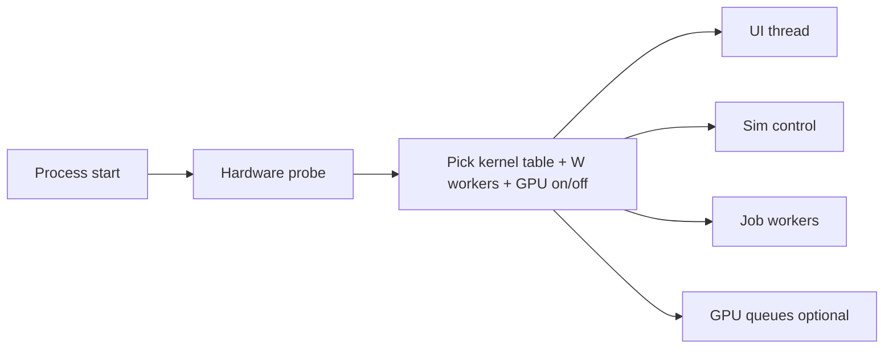

# Use the hardware that is there

Companion diagram: [05-hardware.drawio](diagrams/05-hardware.drawio) (tabs: Hardware probe, Threads & jobs, Physics pipeline, Scaling tiers). This page is the target architecture. **Nothing here is implemented except the fixed `1/60` step and the single-thread loop.**

The goal is not “always GPU” and not “always 64 threads”. The goal is: **on whatever machine the binary booted, fill the parts that pay off, and keep a correct CPU path so the same program still runs in a browser and on a laptop on battery.**

## What the process does today

One OS thread:

1. `GetFrameTime()`
2. `Simulation::step(1/60)` as many times as the accumulator allows — **no cap**
3. ImGui + `DrawCube` into an FBO + present
4. Sleep for VSync / `SetTargetFPS`

The cube’s motion is `sin(time * 3) * 0.25`. There is no collision, no island, no SIMD, no GPU compute. Settings can uncap FPS, which only spins the display thread faster; the solver is still scalar and still on that thread.

That is the right scaffold. The rest of this page is how to grow it without painting the project into a CUDA-only corner (see [portability.md](portability.md)).

## Principle: probe, then assign

At `init`, measure once:

| Probe | Decision |
| --- | --- |
| Logical CPU cores `N` | Worker count `W = max(1, N - 1)` (or `N - 2` if a dedicated render thread exists). Headless: `W = N`. |
| SIMD ISA | Pick a kernel table: SSE2 baseline, AVX2, AVX-512, NEON, WASM SIMD128. Never require the user to recompile for their CPU unless they chose `rel-native`. |
| RAM | Body / pair budget. Arena of SoA chunks; **no `new` per body inside `step()`**. |
| GPU vendor, VRAM, compute queues, subgroup size | Enable `ICompute` only if a portable API is present and the world is large enough to beat PCIe / `gpuBuffer.write` cost. |
| Battery vs AC, vsync preference | On battery: fewer workers, VSync on, skip GPU compute. |

Small worlds are faster on CPU. Kernel launch plus upload of 200 cubes will lose to a tight AVX2 loop. The probe should estimate body count (or last frame’s pair count) and keep a CPU fast-path. **Maximum hardware means “do not leave 15 cores idle,” not “always touch the GPU.”**



## Threading

### Now

```
UI + step + GL submit + present   (one thread)
```

### Target roles

| Thread | Allowed to do | Must not do |
| --- | --- | --- |
| Main / UI | Window, ImGui, camera, present | Run the solver |
| Sim control | Fixed-dt loop, publish snapshots, consume UI commands | Call ImGui or GL |
| Workers `0..W-1` | Broadphase, contacts, island solve, integrate | Touch GL, allocate from a shared heap without an arena |
| GPU queues | Compute dispatches, graphics | Be driven from random workers without a fence plan |

A first increment that already uses a 16-core box: **sim control + workers**, GL still on main. A render thread is a later optimization.

### Snapshot protocol

`visual_body()` is the seed of this:

- Sim writes `WorldSnapshot N+1` while render/UI read `N`.
- UI never writes SoA arrays. It pushes a `Command` (`Play`, `Seek`, `SetCube`, later `AddBody`) onto a queue drained at the start of a step.
- Leftover `accumulator_ / kFixedDt` is the interpolation alpha for rendering between snapshot `N-1` and `N`.

Until that exists, keep stepping on the main thread — do not “just `std::thread` the current `Simulation`” while ImGui mutates `state()` concurrently.

### Job system

- Work-stealing deque per worker.
- Parallel-for over **chunks** (256–1024 bodies), not per-body tasks (task overhead will dominate).
- Islands: independent islands in parallel; contacts inside an island stay serial or color-partitioned.
- Web without pthreads: cooperative jobs pumped from the Emscripten / ASYNCIFY loop. Same `parallel_for` API, different backend.

Cap steps per frame (for example 8). The current unbounded `while (accumulator_ >= kFixedDt)` will freeze the UI after a hitch once the solver is real.

## Data layout

`RigidBody { Vec3 position, size; Rgb color; }` is AoS. Fine for one cube. For the solver:

```text
struct BodyChunk {          // 256 bodies, 64-byte aligned
    float pos_x[256];
    float pos_y[256];
    float pos_z[256];
    float vel_x[256];
    ...
    float inv_mass[256];
    uint32_t flags[256];    // sleeping, kinematic, ...
};
```

`SimulationState` stays the **control block** (time, playing, grid, clear color). Bodies live in a `World` of chunks. `visual_body()` becomes “read body 0 from the published snapshot” for as long as the demo cube remains.

Allocator rule: one arena per worker plus a frame arena on sim control. `step()` does not call the global heap.

## Physics pipeline (target)


| Stage | CPU fast-path | GPU path (portable compute) |
| --- | --- | --- |
| Integrate | SIMD SoA | Usually CPU (trivial) |
| Broadphase | Parallel SAP / spatial hash | Pays off first — huge pair lists |
| Narrowphase | Chunked contacts | Mesh / SDF contacts |
| Islands | Union-find, wake | Often CPU (graph is irregular) |
| Solve | PGS/TGS/XPBD per island | Only when islands are huge |
| Publish | Pointer-swap snapshot | Readback or persistent mapped buffer |

Hybrid workstation (the common “max this PC” case): GPU broadphase + mesh contacts, CPU islands and scene queries, one fence per step. **Never call OpenGL from a worker.**

Reference solver: keep a scalar CPU implementation used in tests and as the web fallback. SIMD and GPU must match it within a documented tolerance.

Determinism: the fixed dt is already there. For replay, add a mode with fixed iteration counts and no unordered hash maps in pair generation. Document IEEE-relaxed vs deterministic when it exists; do not pretend the sine demo is deterministic across compilers.

## ISA dispatch

Ship a **portable baseline** binary (`rel-portable` preset in [portability.md](portability.md)):

- x64: SSE2 or x86-64-v2
- ARM: NEON
- WASM: scalar + optional `simd128`

At runtime, `HardwareProbe` picks function pointers:

```text
integrate_chunk = integrate_chunk_avx2;   // or neon, or scalar
```

`rel-native` (`-march=native`) is for the developer’s box, not GitHub Releases. Users on a 2015 CPU must still run the portable artifact.

## Scaling tiers

Use these as the public definition of “how far is the engine”:

| Tier | Bodies (order of) | Sim backend | Render | Where it runs |
| --- | --- | --- | --- | --- |
| **0 Scaffold (now)** | 1 cube | scalar, main thread | immediate `DrawCube` | this repo |
| **1 Editor** | 10²–10³ | CPU jobs + SIMD | instanced meshes, gizmos | laptops, web demo |
| **2 Workstation** | 10⁴–10⁵ | hybrid CPU islands + GPU broadphase | indirect draw, LOD, sleep | desktops |
| **3 Lab / server** | 10⁶ + batch worlds | GPU compute primary | null or thin debug | headless, later multi-GPU |
| **4 Web demo** | 10²–10³ | WASM SIMD ± WebGPU | WebGL / WebGPU | browsers, tight main-thread budget |

Climbing a tier without breaking everywhere:

1. Keep `ISimulation` and a scalar reference `step()`.
2. Add jobs + SIMD behind that `step()`.
3. Add `ICompute`; feature-flag GPU.
4. Never put raylib types in the world.
5. CI micro-worlds at tier 0 and 1 so a GPU kernel cannot silently break the cube demo.

## Worked assignment examples

From the Hardware probe tab — these are the intended defaults, not user homework:

**4-core laptop, iGPU, on battery.** 2 sim workers, AVX2/NEON, GL render, no GPU compute, VSync on, max 4 substeps. Goal: cool, quiet, 60 FPS editor.

**16-core desktop, 8 GB VRAM dGPU.** 14 workers, AVX2, GPU broadphase + contacts, CPU island solve, display uncapped optional. Goal: tier 2.

**Browser, 4 cores, WebGPU.** 1–3 workers if pthread+COOP/COEP, else cooperative jobs; WASM SIMD; WebGPU compute only if the world is large enough. Goal: tier 4.

**Headless 64-core + 2 GPUs.** No UI thread. 64 workers **or** 1 CPU coordinator + 2 GPU queues, many worlds per process. NUMA pinning is a later lab feature, not a v1 requirement.

## What to implement, in order

This order is deliberately the same spine as [portability.md](portability.md):

1. **Step cap + interpolation alpha** on the current main thread. Cheap, stops hitches from wedging the UI once the solver exists.
2. **Headless `step` loop** (null renderer). Lets you benchmark without VSync.
3. **SoA `World` + scalar integrator** for N cubes, still on one thread. The demo cube becomes body 0.
4. **Job system + parallel integrate / broadphase** with runtime `W`.
5. **SIMD kernels** behind the same chunk API.
6. **`ICompute` + one portable GPU broadphase** (Vulkan or WebGPU — pick the one you will also use on the web). CUDA only as a later extra.
7. **Sleeping islands, instanced draw, GPU/CPU hybrid switch** based on pair count.

Do not start at step 6. A GPU kernel with no scalar reference and no headless clock will not be maintainable and will not run “everywhere.”
