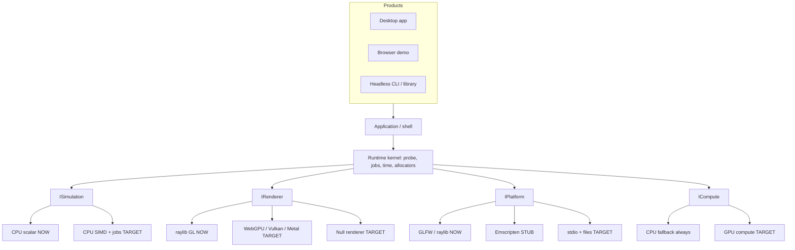

# Run everywhere

Companion diagram: [04-portability.drawio](diagrams/04-portability.drawio) (tabs: Platform matrix, Backend stack, Build & deploy). Build facts: [03-build-graph.drawio](diagrams/03-build-graph.drawio).

“Everywhere” here means **the same simulation core** on the machines people actually use: Windows, Linux, macOS, a browser, and a headless server. Phones are a later product, not a blocker.

## What already points that way

The current tree is a desktop OpenGL app, but several seams are already in place:

| Seam | Where | Why it matters |
| --- | --- | --- |
| `ISimulation` forbids GPU/UI types | `src/logic/ISimulation.h` | The solver can compile for web, server, and tests without GLFW |
| Static linking | `BUILD_SHARED_LIBS OFF` | One executable to copy; no DLL hunt on a foreign PC |
| C++20, no compiler extensions | `CMakeLists.txt` | Same dialect on MSVC, Clang, GCC, Emscripten |
| Apple frameworks listed | `if(APPLE)` | macOS is an intended desktop, not an accident |
| Emscripten block | `if(EMSCRIPTEN OR PLATFORM STREQUAL "Web")` | `.html` suffix, GLFW, ASYNCIFY, WASM |
| Vendored ImGui | `external/imgui` | UI does not depend on a system package |

What is **not** portable yet:

- `Application.cpp` is hard-wired to `InitWindow` / `BeginDrawing`
- `Workspace.cpp` and `Editor.cpp` call raylib for keys, FPS, and the window flags. `IRenderer.h` itself does not include `raylib.h`
- First configure needs the network (FetchContent)
- No CMake presets, no CI matrix, no headless target

## Target layering

Keep the solver in the middle. Swap the boxes around it.



Rules that make the diagram true:

1. **`logic/` compiles with zero graphics headers.** True today. Keep it true.
2. **`IRenderer` does not return GPU types.** True now: the FBO is drawn by `draw_viewport_image()`, implemented only in the raylib renderer.
3. **Camera is an Open PhysX type.** True now: `View3D` in `core/View.h` (quaternion, pivot, distance). `Renderer.cpp` turns it into `Camera3D`.
4. **Headless is a product**, not `if (no_window) skip_draw`. Same `ISimulation`, null renderer, stdio platform. That is how CI and batch jobs saturate cores without a GPU context.
5. **CUDA is an extra `ICompute`, never the only one.** CUDA is NVIDIA-only and cannot be the “everywhere” path. Portable GPU compute is Vulkan / Metal / D3D12 / WebGPU. CPU SIMD is the backend that always exists.

## Platform matrix

| Target | Window / input | Graphics now → later | Compute | Status in this repo |
| --- | --- | --- | --- | --- |
| Windows | GLFW via raylib | OpenGL 3.3+ → optional DX12/Vulkan | CPU; later GPU compute | Primary desktop |
| Linux | X11 / Wayland via GLFW | OpenGL 3.3+ → Vulkan | CPU; later GPU compute | Should build; add CI |
| macOS | Cocoa (frameworks already linked) | OpenGL (legacy) → Metal or MoltenVK | CPU; later Metal | CMake ready; add CI |
| Web | canvas, ASYNCIFY | WebGL (raylib) → WebGPU | WASM SIMD ± WebGPU | Link flags only |
| Headless | none | null renderer | all cores + optional GPU | Missing |
| Android / iOS | later | GLES / Metal | CPU first | Out of scope until desktop/web/headless are real |

The solver row is the same for every line. Only adapters change.

## Renderer contract (the leak is closed)

`IRenderer.h` includes `core/View.h` only. `draw_viewport_image()` is the blit. `rlImGuiImageRenderTexture` stays in `Renderer.cpp`. A null or WebGPU renderer can implement the header. What is still raylib-shaped is the process shell (`Application` window loop, key polling in `Editor`), not the camera math.

`Application` should also stop being the window. Split:

| Type | Responsibility |
| --- | --- |
| `IPlatform` | create/destroy surface, poll events, time, clipboard, files |
| `DesktopPlatform` | current raylib window |
| `WebPlatform` | Emscripten main loop (`emscripten_set_main_loop` instead of `while`) |
| `HeadlessPlatform` | `step` until a frame count or a file of commands |

The web port cannot use `while (!WindowShouldClose())` — ASYNCIFY can fake it, but a real loop callback is the maintainable path.

## Feature flags

Keep these as CMake options so a laptop, a CI image, and a web build do not compile the same backends.

```
OPENPHYSX_UI            # ImGui workstation (default ON)
OPENPHYSX_HEADLESS      # no window, no ImGui
OPENPHYSX_SIMD          # ISA kernels
OPENPHYSX_JOBS          # worker pool
OPENPHYSX_GPU_VK        # Vulkan compute + optional gfx
OPENPHYSX_GPU_WGPU      # WebGPU (native via wgpu, web via browser)
OPENPHYSX_CUDA          # optional extra, NVIDIA labs only
```

A portable release binary: `UI=ON`, `SIMD=ON` (runtime dispatch), `JOBS=ON`, GPU backends compiled in if the SDK was present **or** delayed-loaded. A web binary: `UI=ON`, `SIMD=ON` (WASM SIMD), `JOBS` only if pthread + COOP/COEP, `GPU_WGPU` if the browser path is ready. A server binary: `HEADLESS=ON`, `JOBS=ON`, GPU optional.

## Build matrix

Add `CMakePresets.json` (the repo gitignores *user* presets, which is correct):

| Preset | Intent |
| --- | --- |
| `dev-debug` | asserts, `OPENPHYSX_DEBUG`, ASan/UBSan on Clang/GCC |
| `rel-portable` | `-O2` / `/O2`, baseline ISA (`x86-64-v2` or `armv8-a`) |
| `rel-native` | `-march=native` for the machine you sat down at — **not** the shipped artifact |
| `web-release` | `emcmake`, existing WASM flags + `ALLOW_MEMORY_GROWTH`, `SIMD128` |
| `headless` | `OPENPHYSX_HEADLESS`, skip raylib window |

CI (GitHub Actions is enough):

- `windows-latest` MSVC and ClangCL
- `ubuntu-latest` gcc and clang
- `macos-latest` AppleClang
- one Emscripten job producing `.html` + `.wasm`
- one Linux ASan/UBSan job on a tiny “step 600 frames headless” test

**FetchContent vs offline.** First configure today needs GitHub. For “it builds on an airplane / in a firewalled lab”:

1. Pin tarball **hashes** in `FetchContent_Declare` (`URL_HASH SHA256=…`).
2. Or vendor raylib and rlImGui the same way ImGui is vendored.
3. CI should cache `_deps`.

GPL-3: any binary you ship must come with Corresponding Source (this tree, including the fetched versions you actually linked).

## Web specifics

Already in `CMakeLists.txt`:

```
-sUSE_GLFW=3 -sASYNCIFY -sASSERTIONS=1 -sWASM=1 -sGL_ENABLE_GET_PROC_ADDRESS=1
```

Add when you actually ship a page:

- `-sALLOW_MEMORY_GROWTH=1`
- `-msimd128` and a WASM SIMD kernel table
- pthread only with `Cross-Origin-Opener-Policy` / `Cross-Origin-Embedder-Policy` headers; otherwise pump a cooperative job queue from the ASYNCIFY loop
- do not FetchContent at **runtime** — all content is in the packed `.data` or inlined
- cap workers; a phone browser is not a 16-core desktop (see [hardware.md](hardware.md) tier 4)

## Packaging

| Product | Artifact |
| --- | --- |
| Desktop | zip/tar of the executable + `LICENSE` + licenses of raylib/ImGui/rlImGui |
| Web | `.html` + `.js` + `.wasm` + `.data` |
| Embed | `libopenphysx_core` (simulation only) for people who want their own window |

Do not require an installer. A copied folder that runs is “everywhere” for desktops.

## Order of work (so portability does not stall the solver)

1. Close the `IRenderer` raylib leak; introduce `CameraState` + `ViewportHandle`.
2. `NullRenderer` + a `headless` CMake option that still links `Simulation` and steps in a loop. This unblocks CI and hardware work.
3. CMake presets + CI on Win/Linux/macOS.
4. Pin FetchContent hashes (or vendor).
5. Emscripten as a real preset; replace the busy `while` with the Emscripten main loop.
6. `IPlatform` / `ICompute` only when a second backend is actually being written — do not abstract ahead of the second implementation.

Step 2 is also the first step of [hardware.md](hardware.md): you cannot measure a solver that only runs inside a 60 Hz window.
